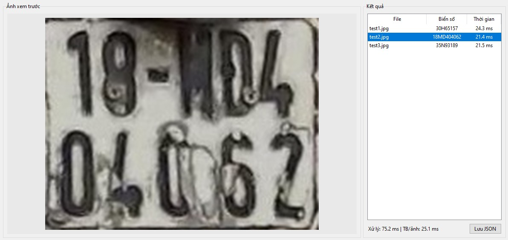

# K-OCR — OCR biển số xe Việt Nam

Dự án nhận dạng ký tự (OCR) trên ảnh biển số xe đã được crop sẵn, dùng kiến
trúc CNN (stem + residual stages) + BiLSTM + CTC, định nghĩa tại
[`plate_recognizer.py`](plate_recognizer.py).

## 1. Cấu trúc dự án

```
K-OCR/
  plate_recognizer.py           # Kiến trúc model (CNN + BiLSTM + CTC)
  charset.py                    # Bảng ký tự + encode/decode CTC
  dataset.py                    # PlateDataset, augmentation, collate_fn cho CTC
  train.py                      # Script train model từ đầu
  tune.py                       # Script fine-tune / train tiếp từ 1 checkpoint có sẵn
  infer.py                      # Script chạy thử / demo inference
  export.py                     # Script export model sang ONNX / OpenVINO (FP32/FP16/INT8)
  generate_dummy_data.py        # Tạo dữ liệu giả lập để test nhanh pipeline
  requirements.txt
  data/
    README.md                  # Hướng dẫn định dạng dữ liệu
    train/{images/, labels.txt}
    val/{images/, labels.txt}
  checkpoints/                  # Nơi lưu model đã train (best_model.pt, last_model.pt)
  exported_models/              # Nơi lưu model đã export (onnx, openvino IR) — tạo bởi export.py
```

## 2. Kiến trúc model (tóm tắt)

Input `[B, 3, 112, 224]` → Stem → 3 Residual stage → AdaptiveAvgPool theo
chiều cao → sequence `[B, 56, 256]` → 2 lớp BiLSTM → Linear classifier →
logits `[B, 56, num_classes]`. Chi tiết đầy đủ xem docstring trong
[`plate_recognizer.py`](plate_recognizer.py).

`num_classes` = số ký tự trong `charset.py` + 1 (lớp blank của CTC).

## 3. Cài đặt

```bash
python -m venv venv
venv\Scripts\activate          # Windows
pip install -r requirements.txt
```

Nếu chỉ có CPU, có thể cài PyTorch bản CPU theo hướng dẫn tại
https://pytorch.org/get-started/locally/ trước khi cài các phần còn lại.

## 4. Chuẩn bị dữ liệu

Xem chi tiết tại [`data/README.md`](data/README.md).

Chưa có dữ liệu thật? Tạo dữ liệu giả lập để test pipeline trước:

```bash
python generate_dummy_data.py --data-dir data --train-samples 200 --val-samples 40
```

## 5. Train

```bash
python train.py --data-dir data
```

`--epochs`, `--batch-size`, `--lr` mặc định là **tự động** — nếu không
truyền tay, `train.py` sẽ đếm số ảnh trong `data/train/labels.txt` và tự
chọn theo bảng dưới (xem `auto_hparams()` trong [`train.py`](train.py)).
Data ít cần train nhiều epoch hơn để hội tụ nhưng batch nhỏ hơn; data
nhiều thì ngược lại (batch lớn hơn, epoch ít hơn, lr cao hơn theo "linear
scaling rule"):

| Số ảnh train      | `--batch-size` | `--epochs` | `--lr` |
|-------------------|----------------|------------|--------|
| < 500             | 8              | 150        | 5e-4   |
| 500 – 2.000       | 16             | 100        | 7e-4   |
| 2.000 – 10.000     | 32             | 60         | 1e-3   |
| 10.000 – 50.000    | 64             | 40         | 1.5e-3 |
| > 50.000          | 128            | 25         | 2e-3   |

Chỉ định tham số nào thì tham số đó không tự động nữa, các tham số còn lại
vẫn tự động. Ví dụ:

```bash
# Data nhỏ (~300 ảnh): dùng nguyên mặc định tự động
python train.py --data-dir data

# Data vừa (~5.000 ảnh): giữ batch/epoch tự động, chỉ ép lr thấp hơn
python train.py --data-dir data --lr 5e-4

# Data lớn (~80.000 ảnh) trên GPU: tự tăng batch/epoch theo bảng trên,
# chỉ cần tăng num-workers để đọc ảnh không nghẽn
python train.py --data-dir data --num-workers 8

# Ép cứng toàn bộ, không dùng tự động (ví dụ máy yếu, muốn batch nhỏ)
python train.py --data-dir data --epochs 30 --batch-size 16 --lr 5e-4
```

Các tham số chính:

| Tham số          | Mặc định | Ý nghĩa                                   |
|------------------|----------|--------------------------------------------|
| `--data-dir`     | `data`   | Thư mục gốc chứa `train/` và `val/`         |
| `--epochs`       | tự động (xem bảng trên) | Số epoch                     |
| `--batch-size`   | tự động (xem bảng trên) | Batch size                   |
| `--lr`           | tự động (xem bảng trên) | Learning rate (AdamW)        |
| `--weight-decay` | 1e-4     | Weight decay (AdamW)                        |
| `--lstm-hidden`  | 192      | Hidden size mỗi chiều của BiLSTM             |
| `--lstm-layers`  | 2        | Số lớp BiLSTM                               |
| `--dropout`      | 0.1      | Dropout giữa các lớp LSTM                   |
| `--num-workers`  | 2        | Số worker đọc data song song                |
| `--output-dir`   | `checkpoints` | Nơi lưu `best_model.pt`, `last_model.pt`, `history.json` |
| `--resume`       | ""       | Đường dẫn checkpoint để train tiếp          |

Kết quả: `checkpoints/best_model.pt` (checkpoint có CER thấp nhất trên tập
val), `checkpoints/last_model.pt` (checkpoint epoch cuối), `history.json`
(log loss/CER từng epoch).

CER (Character Error Rate) = tỉ lệ ký tự sai (dựa trên khoảng cách chỉnh
sửa Levenshtein) trên tập validate — càng thấp càng tốt.

## 6. Tune (fine-tune / train tiếp từ checkpoint có sẵn)

`tune.py` **không** train từ đầu — nó load lại một checkpoint đã train
bằng `train.py` (kiến trúc `lstm_hidden/lstm_layers/dropout` được tự động
lấy từ checkpoint, không cần truyền tay), rồi train tiếp trên
`data/train` với learning rate thấp hơn hẳn để tinh chỉnh thêm mà không
phá vỡ những gì model đã học. Dùng khi:

- Có thêm data mới, muốn train tiếp model đã có thay vì train lại từ đầu.
- Model đã train nhưng chưa hội tụ hẳn / muốn ép CER thấp hơn nữa.

```bash
python tune.py --checkpoint checkpoints/best_model.pt --data-dir data
```

`--epochs`, `--batch-size`, `--lr` cũng mặc định **tự động** theo số ảnh
train (xem `auto_finetune_hparams()` trong [`tune.py`](tune.py)), nhưng
`lr` mặc định thấp hơn nhiều so với train từ đầu (`train.py`) và số epoch
cũng ít hơn vì xuất phát từ weight đã tốt sẵn:

| Số ảnh train      | `--batch-size` | `--epochs` | `--lr`  |
|-------------------|----------------|------------|---------|
| < 500             | 8              | 60         | 1e-4    |
| 500 – 2.000       | 16             | 40         | 1.5e-4  |
| 2.000 – 10.000     | 32             | 25         | 2e-4    |
| 10.000 – 50.000    | 64             | 15         | 3e-4    |
| > 50.000          | 128            | 10         | 5e-4    |

Ví dụ:

```bash
# Fine-tune từ model đã train, dùng toàn bộ mặc định tự động
python tune.py --checkpoint checkpoints/best_model.pt --data-dir data

# Có data mới bổ sung vào data/train, train tiếp model cũ, ép lr thấp hơn nữa
python tune.py --checkpoint checkpoints/best_model.pt --data-dir data --lr 5e-5

# Fine-tune model cũ nhưng lưu ra thư mục riêng để so sánh với bản gốc
python tune.py --checkpoint checkpoints/best_model.pt --data-dir data \
    --output-dir checkpoints_finetuned_v2 --epochs 20
```

Kết quả lưu tại `checkpoints_finetuned/best_model.pt` (mặc định), cùng
`last_model.pt`/`history.json` giống hệt `train.py`.

Nếu muốn tìm kiến trúc/siêu tham số tốt nhất từ đầu (thử nhiều
`lstm_hidden`/`dropout`/... khác nhau) thay vì train tiếp từ model cũ, đó
là hyperparameter search — hiện dự án chưa có script riêng cho việc này,
chỉ có thể thử thủ công nhiều lần bằng `train.py` với các tham số khác
nhau rồi so sánh `val_cer` trong `history.json`.

## 7. Chạy thử / demo (inference)

```bash
python infer.py --checkpoint checkpoints/best_model.pt --input data/val/images/plate_00000.jpg
```

Hoặc chạy trên cả thư mục ảnh:

```bash
python infer.py --checkpoint checkpoints/best_model.pt --input data/val/images --output-json results.json
```

Output in ra console dạng `tên_ảnh -> biển_số_dự_đoán`, và có thể lưu toàn
bộ kết quả ra file JSON qua `--output-json`.

## 8. Export sang ONNX / OpenVINO

```bash
python export.py --checkpoint checkpoints/best_model.pt --format both
```

`--format` nhận `onnx`, `openvino`, hoặc `both` (mặc định). Kết quả lưu
tại `exported_models/`:

- `plate_recognizer.onnx` — dùng với ONNX Runtime hoặc các framework khác
  hỗ trợ ONNX.
- `plate_recognizer_fp32.xml/.bin`, `plate_recognizer_fp16.xml/.bin` —
  OpenVINO IR, dùng với OpenVINO Runtime trên CPU/GPU Intel.
- `plate_recognizer_int8.xml/.bin` — chỉ xuất khi truyền `--int8`, quantize
  bằng **ảnh thật lấy từ `data/train/images`** (không phải random) để đảm
  bảo độ chính xác sau quantize sát với model gốc.

Các tham số chính:

| Tham số                       | Mặc định         | Ý nghĩa                                        |
|--------------------------------|------------------|--------------------------------------------------|
| `--checkpoint`                 | `checkpoints/best_model.pt` | Checkpoint đã train                |
| `--format`                     | `both`           | `onnx` / `openvino` / `both`                     |
| `--output-dir`                 | `exported_models`| Thư mục lưu kết quả export                        |
| `--opset`                      | 17               | ONNX opset version                                |
| `--fp16` / `--no-fp16`         | bật              | Có xuất thêm bản OpenVINO FP16 hay không           |
| `--int8`                       | tắt              | Có xuất thêm bản OpenVINO INT8 (cần `pip install nncf`) |
| `--int8-calibration-samples`   | 100              | Số ảnh thật (từ `data/train/images`) dùng calibrate INT8 |

Ví dụ chỉ export ONNX:

```bash
python export.py --checkpoint checkpoints/best_model.pt --format onnx
```

Ví dụ export OpenVINO đầy đủ (FP32 + FP16 + INT8), calibrate bằng 200 ảnh
thật:

```bash
python export.py --checkpoint checkpoints/best_model.pt --format openvino \
    --int8 --int8-calibration-samples 200
```

**Lưu ý:**
- Model dùng LSTM nên ONNX export cố định batch size = 1 (cảnh báo về
  batch size khác 1 khi export có thể bỏ qua nếu chỉ inference batch=1).
- Cần cài `pip install openvino` (và thêm `nncf` nếu dùng `--int8`).

## 9. Quy trình gợi ý tổng thể

1. `generate_dummy_data.py` → kiểm tra toàn bộ pipeline chạy được (train,
   tune, infer) với dữ liệu giả lập.
2. Thay dữ liệu giả lập bằng ảnh biển số thật theo đúng định dạng trong
   `data/README.md`.
3. `train.py` để train model từ đầu.
4. `infer.py` để kiểm tra kết quả trên ảnh thật / thư mục ảnh test.
5. Có thêm data mới hoặc muốn cải thiện thêm? Dùng `tune.py` để train tiếp
   (fine-tune) từ checkpoint đã có, thay vì train lại từ đầu.
6. `export.py` để xuất model sang ONNX/OpenVINO khi cần triển khai thực tế.

## 10. Kết quả chạy thử sau khi train


- Cấu hình chạy thử: i3-8100U CPU
(Nếu export qua OpenVINO thời gian chạy sẽ ít hơn)

